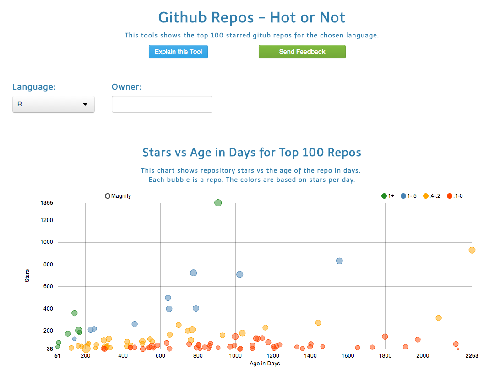

## A D3 chart example 
<iframe src=' assets/fig/unnamed-chunk-1-1.html ' scrolling='no' frameBorder='0' seamless class='rChart nvd3 ' id=iframe- chart95ac16a6a091 ></iframe> <style>iframe.rChart{ width: 100%; height: 400px;}</style>

<!-- Limit image width and height -->
<style type='text/css'>
img {
    max-height: 400px;
    max-width: 800px;
}
</style>

<!-- Center image on slide -->
<script src="http://ajax.aspnetcdn.com/ajax/jQuery/jquery-1.7.min.js"></script>
<script type='text/javascript'>
$(function() {
    $("p:has(img)").addClass('centered');
});
</script>

--- &radio
## Quiz

How many lines of code did I write to make this chart?

1. _1_
2. 10
3. 100
4. 1000

*** .hint
I used rCharts not javascript/html/css

*** .explanation
```s
n1 <- nPlot(y ~ x, group = , data = , type =)
```

---
## Github Hot or Not Shiny App
* Demonstrates the power of rCharts (D3) inside a shiny app. 
* See what langauges are more popular on Github
* Use it to help decide which language you may want to learn next
* See the most popular repos and go directly to them to explore
* See the top repos for your favorite language and who created it

---
## Github Hot or Not Shiny App
http://surlyanalytics.shinyapps.io/github_hot_or_not/
  



